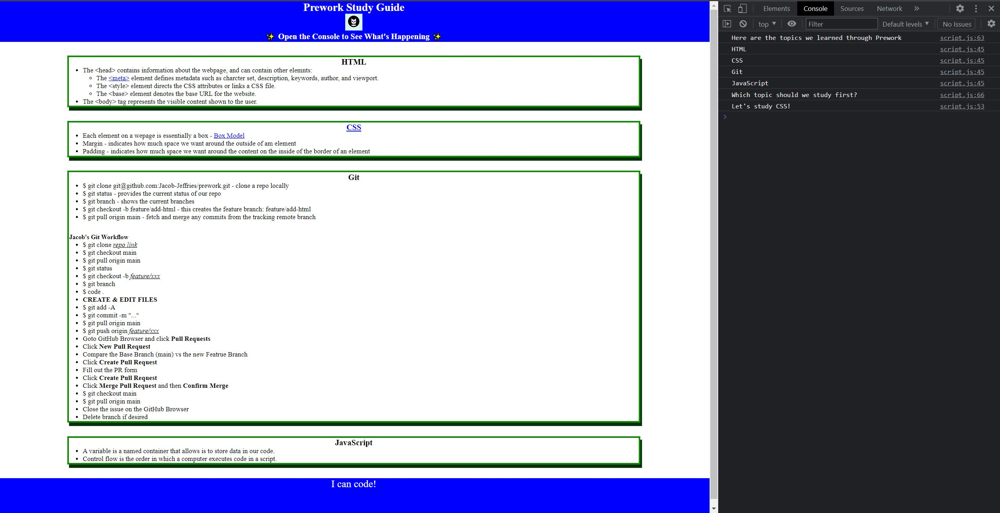

# MSU Full-Stack Coding Bootcamp Prework

## Description
This web app was developed to such that I could learn the basics of HTML structure, CSS style, Git Flow, and finally JavaScript logic. 

The main problem that this project solves is to help me remember the Git Flow, as this is a new concept for me and having a reminder is very handy. 

Through the course of programing this wesite, I learned the Git workflow and created my own process. I also learned the basics of Javascript (as I've used PHP in the past to add logic to my websites).

## Table of Contents
[Installation](#installation)
[Usage](#usage)
[Credits](#credits)
[License](#license)
[Badges](#badges)

## Instalation
This is a hosted website and does not require any installion other than a internet browser. I recommend Mozilla Firefox, since Google Chrome is stealing your data!

## Usage
This is an easy to use webiste that mainly contains static text. 

If you open the DevTools and click on CONSOLE, the JS script can be seen running in the background.

<<<<<<< HEAD
```md

```
=======


>>>>>>> 36943327311a7442bec230dfd07177d3f7402382
## Credits
Jacob Jeffries

## License
MIT License

## Badges

